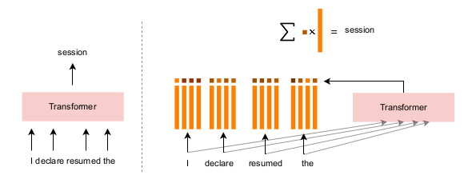

# Multilingual Backpack Language Models
           


This repository contains the code, data, and experiments for the Multilingual Backpack Language Model, a project aimed at extending Backpack LMs to multilingual settings. Backpack LMs provide a flexible interface for interpretability and control in language modeling by explicitly encoding multiple senses for words. This work explores training Backpack LMs on parallel French-English corpora to efficiently handle polysemy in multilingual contexts.

## Table of Contents

- [Introduction](#1-introduction)
- [Installation](#2-installation)
- [Datasets](#3-datasets)
- [Training](#4-training)
- [Evaluation](#5-evaluation)
- [Key Findings](#6-key-findings)


## 1. Introduction

Backpack LMs learn multiple sense vectors per word, allowing for explicit modeling of polysemous words. Previously tested in monolingual settings for English and Chinese, this project extends the Backpack architecture to multilingual modeling by training on both English and French using Europarl and MultiUN datasets. The multilingual Backpack LM efficiently encodes word meanings across languages, demonstrating lower perplexity and improved accuracy on cloze tasks compared to baseline GPT-2 models.



## 2. Installation

<!--The project requires the following dependencies:
  - Python 3.10
  - PyTorch 2.0.1+
  - CUDA 18
  - NumPy 1.23.5
  - pandas
  - matplotlib
  - wandb
  - tiktoken
  - datasets
  - dataclasses
  - PyMultiDictionary
  - language_tool_python
  - tqdm
  -->
  
1. Clone this repository.

```bash
git clone https://github.com/clemsadand/multilingual-backpack-lm.git
cd multilingual-backpack-lm/working_dir
```

2. You need to install NVIDIA-drivers. Run:

```bash
cd bkp_install
bash bkp_nvidia.sh 
```

3. You may need to install anaconda or miniconda. To install miniconda, run:

```bash
cd bkp_install
bash anaconda.sh
```

4. You need to create a virtual environment with Python3.10.

  - With conda:
  
  ```bash
  conda create --name bkp python=3.10
  conda activate bkp # to activate
  ```

  - Without conda:

  ```bash
  python3.10 -m venv bkp
  source bkp/bin/activate #to activate
  ```

5. To install the required packages, run:

```bash
pip install numpy==1.23.5
pip install language_tool_python PyMultiDictionary tqdm wandb gdown tiktoken dataclasses datasets 
pip install torch==2.0.1
pip install --pre torch torchvision torchaudio --index-url https://download.pytorch.org/whl/nightly/cu118
```
## 3. Datasets

The multilingual Backpack LM is trained on the following datasets:
  - [Europarl](https://www.statmt.org/europarl/): Parallel French-English corpus from the European Parliament proceedings.
  - [MultiUN](https://opus.nlpl.eu/MultiUN/en&fr/v1/MultiUN): Parallel corpus extracted from United Nations documents.
To download these datasets, run:

```bash:
cd data
bash get_data.sh
```

We trained a [customized tokenizer](working_dir/tokenizer) on Europarl and MultiUn with 10K tokens.

  - To tokenize these datasets and preprocess for training, run:

```bash:
cd data
bash europarl/prepare.py
bash multiun/prepare.py
```
  - To use the tokenized and preprocessed data, download [Europarl](https://drive.google.com/file/d/166DkV_hK7aYoIELXTZjDfmJni79_P-S4/view?usp=sharing) and [MultiUN](https://drive.google.com/file/d/1lwHiRw03d1Tb6QnqDSJQB1Xl03-8iyZ2/view?usp=sharing), and place them in `data/europarl` and `data/multiun` respectively.


Figure above present the workflow of the data preprocessing. The diagram illustrates the steps from merging bilingual corpora (Europarl and MultiUN) to training a customized BPE tokenizer. It includes processes for tokenizing the Europarl French corpus and splitting the tokenized data into train, validation, and test sets for further processing.

## 4. Training

We save the checkpoints of the different models trained on Europarl and MultiUN to Google Drive.

|Model | Parameters| Number of sense vectors |
|:-----------------:|:--------------:|:-------------:|
|[Mini-GPT2](https://drive.google.com/file/d/1YxlRtqGeg-ISILtxDl0p6t4IrQR2qe-Y/view?usp=sharing)| 14M | - |
|[Mini-Backpack-16](https://drive.google.com/file/d/1Q3ZXjrMXZylwCGqyFoHfBzX2gf09z_M3/view?usp=sharing)| 19M | 16 |
|[Small-GPT2](https://drive.google.com/file/d/1gwbNGrDZ1MMR1L_nxfoQ1x9y_BgF5-gn/view?usp=sharing)| 93M | - |
|[Small-Backpack-16](https://drive.google.com/file/d/1bSEPVB42utEsIRyELnIgLQ0S9F0iyrIg/view?usp=sharing)| 112M | 16|


To train a Backpack LM model or GPT2, follow these steps:
1. Configure the training setup:
  - Modify the configuration file in config/ to set up the training parameters (e.g., `model_name`, `wandb_log`, `learning_rate`, `device`).
2. Train the model:
  - Start training with the following command:
```bash
python3.10 train.py config/train_small_16.py --out_dir=out-bkp-small-16 --model_name=backpack-lm
```
  - Resume a training with following command:
```bash
python3.10 train.py config/train_small_16.py --out_dir=out-bkp-small-16 --model_name=backpack-lm --init_from=resume
```

## 5. Evaluation

The evaluation includes both intrinsic and extrinsic metrics:
  - Perplexity: Assesses the model’s ability to predict held-out text.
```bash
python3.10 perplexity_per_lang.py config/train_mini_16.py --model_name=backpack-lm --out_dir=out-bkp-mini-16 --device=cuda
```
  - Cloze task: Measures the model’s accuracy in filling in missing words.
```bash
python3.10 cloze_test.py --model_name=backpack-lm --out_dir=out-bkp-small-16 --device=cuda
```
  - Sense visualization: Analyzes the learned sense vectors for word representation.
```bash
python3.10 sense_visualisation.py --model_name=backpack-lm --out_dir=out-bkp-small-16 --device=cuda
```


## 6. Key Findings
This research marks the first application of Backpack LMs in multilingual settings, specifically training them on English and French corpora simultaneously.

### 6.1. Efficient Learning
The models efficiently learn word meanings without encoding language-specific sense vectors, allowing them to handle polysemous words effectively.

### 6.2. Performance Metrics
The Backpack LM (112M parameters) achieved lower perplexity scores compared to a baseline GPT2 (93M parameters). It slightly outperformed the baseline in a cloze task in top-1 accuracy.<!--, demonstrating superior context-dependent generation capabilities.-->

### 6.3. Sense Visualisation

We found that the multilingual Backpack LMs learn different aspects of word meaning in different senses and these senses appear to serve the same function for both languages most of the time proving a language-independent senses. For example, sense 4 encodes different grammatical forms, with related nouns and adverbs in both languages for almost all words.

| Sense 4 (English words)             |               |                |
|---------------------|---------------|----------------|
| **rights**          | **law**      | **quick**      |
| rights              | law           | quick          |
| Universal           | law           | quick          |
| constitutions       | jur           | faster         |
| right               | Arrest        | fast           |
| Covenant            | judges (juges)| quickest       |

| Sense 4 (French words)            |               |                |
|---------------------|---------------|----------------|
| **equality (égalité)**  | **job (emploi)**  | **necessary (nécessaire)** |
| equality (égalité)  | job (emploi)  | necessary (nécessaire) |
| males (masculins)   | job (emploi)  | indispensable (indispensables) |
| discriminations     | employment    | necessary (nécessaire) |
| inequality (inégalité) | unemployed (chômeurs) | indispensable (indispensable) |
| feminine (féminin)  | job (emploi)  | essential (primordiales) |


### 6.4. Sense Vector Analysis

The study found that the sense distributions learned by the Backpack LMs do not vary significantly across languages, suggesting that these models can effectively share sense vectors between languages without losing semantic accuracy.

## Acknowledgements
This implementation is based on the Github repo [nano-BackpackLM](https://github.com/SwordElucidator/nanoBackpackLM). <!--The Github repo of the Backpack Language Models is [here](https://github.com/john-hewitt/backpacks-flash-attn). -->

## References

- **Backpack Language Models**: [Backpack Language Models](https://arxiv.org/abs/2305.16765) by John Hewitt, John Thickstun, Christopher D. Manning, and Percy Liang (2023).
  
- **Character-level Chinese Backpack Language Models**: [Character-level Chinese Backpack Language Models](https://arxiv.org/abs/2310.12751) by Hao Sun and John Hewitt (2023).

